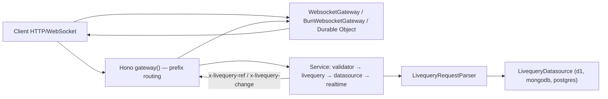

# AGENTS.md

This document is for AI agents and developers working in `@livequery/core`.

## Project Purpose

`@livequery/core` is the framework-agnostic runtime package for Livequery.

It provides:

- Shared request/response/context types.
- A handler interface for parser, middleware, datasource, auth, and realtime layers.
- Request parsing into normalized Livequery refs.
- Prefix routing for a gateway, and the response headers a service uses to drive realtime.
- The realtime protocol engine, plus a WebSocket adapter per runtime.
- Response sanitization helpers.

The package does not execute database queries and does not depend on one HTTP framework.

## Livequery Specification

Before implementing request parsing, handlers, datasources, custom actions, response bodies, or
realtime emission behavior, read `LIVEQUERY_SPEC.md`. That file is the canonical framework- and
database-independent definition of refs, path grammar, actions, response envelopes and the
realtime wire protocol.

## Current Public API

Entry points, each in `src/`:

| Entry | File | Exports |
| --- | --- | --- |
| `@livequery/core` | `index.ts` | `const.ts`, `LivequeryContext.ts`, `LivequeryDatasource.ts`, `LivequeryQuery.ts`, `LivequeryRealtime.ts`, `LivequeryRequestParser.ts`, `LivequeryBaseEntity.ts`, `WebsocketGatewayBase.ts`, `RealtimeBroker.ts`, `gateway/` (prefix routing), `helpers/` |
| `@livequery/core/node` | `node.ts` | root + `WebsocketGateway.ts` (`ws`) + the http ↔ Fetch helpers |
| `@livequery/core/bun` | `bun.ts` | root + `BunWebsocketGateway.ts` |
| `@livequery/core/workers` | `workers.ts` | root + `cloudflare/` (hibernating gateway, router, publisher) + `EdgeWebsocketGateway.ts` |

The root must stay runtime-neutral: `tests/root-entrypoint.test.ts` walks its import graph and
fails on a Node built-in, `ws`, or a runtime entry.

## Architecture



## Module Guide

### `src/LivequeryContext.ts`

Core type definitions:

- `CollectionResponse<T>`: collection response with `items`, `paging`, and `cursor`.
- `DocumentResponse<T>`: document response with `item`.
- `RawRequest`: framework-adapter request shape.
- `LivequeryRequest<I>`: normalized request produced by `LivequeryRequestParser`.
- `LivequeryContext<T>`: shared context passed through handler pipelines.
- `LivequeryHandler<O>`: interface with `handle(ctx)`.

When adding a pipeline component, prefer implementing `LivequeryHandler`.

### `src/LivequeryRequestParser.ts`

First handler in a typical request pipeline.

- Input: `ctx.request`. Output: `ctx.livequery`.
- Requires the first path segment to be `livequery` and parses the data ref from the next segment.
- Removes query strings before parsing path segments.
- Removes suffixes after `~` in the pathname while preserving `~` inside query values.
- Detects document requests when the route pattern ends with a param segment.
- Uppercases the request method.

Important test cases: collection path; document path; nested collection and document paths; query
string and `~` suffix handling; query strings containing `~`; missing document ids for
document-shaped route patterns; paths missing the required Livequery prefix; empty path.

### `src/LivequeryDatasource.ts`

Type abstraction for datasource adapters. A datasource implements `handle(ctx)` and `init(routes)`.
This file defines types only; it exports no runtime class.

### `src/gateway/matchService.ts`

Prefix routing for a gateway: walks the `ServiceRouting` tree segment by segment, keeps the deepest
`$service`, and matches any segment against a `:name` key. A service owns everything under its
prefix, so adding a route inside a service needs no gateway change.

`LIVEQUERY_REF_HEADER` (`x-livequery-ref`) and `LIVEQUERY_CHANGE_HEADER` (`x-livequery-change`) in
`src/const.ts` are how a service tells the gateway to subscribe or publish. The service never holds
a socket.

### `src/WebsocketGatewayBase.ts`

The realtime protocol engine, runtime-neutral. Extends `Subject<UpdatedData>` and implements
`LivequeryHandler`. Runtime adapters drive it through `onConnection`, `onMessage` and `onClose`.

Options (`WebsocketGatewayOptions`):

| Option | Default | Meaning |
| --- | --- | --- |
| `id` | random | Fixed gateway id, so it survives a restart. |
| `disconnectGraceMs` | `5000` | How long a dropped client keeps its subscriptions. `<= 0` detaches synchronously. |
| `allowClientSubscribe` | `false` | When false, a `subscribe` frame from a non-gateway socket is ignored — a client can only be subscribed by an authorized read. |
| `binary` | — | Value of `hello.binary`; msgpack frames when true. |

Public API: `id`, `auth`, `handle(ctx)`, `listen(events)`, `unsubscribe_client(socket, body)`,
`detach(clientId, refs)`, `link(ref, handler)`, `connect(url, auth, ...)`, `close()`.

Behavior:

- Client start event: `{ event: 'start', data: { id, auth } }`. Gateway-to-gateway auth uses `this.auth`.
- A duplicate socket id is closed.
- `next(updatedData)` broadcasts `sync` to subscribers of `ref` and `${ref}/${data.id}`.
- `handle(ctx)` reads `ctx.livequery.ref`, `x-lcid` or `socket_id`, and `x-lgid`.
- `link(ref, handler)` creates an update stream only when the ref already has a subscription.
- A socket that is not alive is skipped during fan-out, and nothing is replayed to it later. See
  `TODO.md` — this is the known reconnect gap, not an oversight to fix casually.

Runtime adapters: `WebsocketGateway` (`/node`, on `ws`, `attach()`/`close()`),
`BunWebsocketGateway` (`/bun`, own `Bun.serve` or shared handlers),
`HibernatableWebsocketGateway` (`/workers`, Durable Object with storage + alarms).

### Helpers

`src/helpers/hidePrivateFields.ts`

- `hidePrivateFieldsInItem(item)`: removes fields starting with `_`, and maps `_id` to `id` when `id` is missing.
- `hidePrivateFields(data)`: supports plain items, collection responses, and document responses.

`src/helpers/nodeRequestToWebRequest.ts`

- Converts Node.js `IncomingMessage` with optional `rawBody` into a Web `Request`.
- Uses the host header or `127.0.0.1`, merges `extraHeaders`, omits body for `GET` and `HEAD`.

`src/helpers/writeWebResponse.ts`

- Copies a Web `Response` into a Node.js `ServerResponse`.

`src/helpers/toLivequeryError.ts`

- Normalizes anything thrown into an `Error` carrying `status` and `code`, because datasources
  throw plain `{ status, code, message }` objects and frameworks only pass `Error` to error handlers.

## Repository Rules

- Source is TypeScript ESM. Source imports must use `.js` extensions.
- Do not import through `src/index.ts` from inside `src`; import direct modules to avoid circular dependencies.
- Public runtime APIs must be exported from `src/index.ts`.
- When changing public classes or functions, update tests, `README.md`, and this file.
- Tests use `bun:test`. Test type-checking uses `tests/tsconfig.json`.
- Close gateway instances in tests to avoid socket leaks.
- HTTP server tests should close servers and active connections.

## Commands

```sh
bun run build
bun test tests/
bunx tsc -p tests/tsconfig.json --noEmit
```

## Test Layout

- `tests/root-entrypoint.test.ts`: the root import graph stays free of Node built-ins and `ws`.
- `tests/protocol-entrypoint.test.ts`: public exports of the root entry.
- `tests/parseLivequeryRequest.test.ts`: `LivequeryRequestParser`.
- `tests/matchService.test.ts`: prefix routing.
- `tests/websocket-gateway.test.ts`: socket lifecycle, subscriptions, observable links, gateway bridge.
- `tests/bun/`: `BunWebsocketGateway`, the shared base, and the Bun http helpers.
- `tests/cloudflare/`: `HibernatableWebsocketGateway` and `CloudflareRealtimePublisher`.
- `tests/decodeRealtimeFrame.test.ts`: JSON and msgpack frame decoding.
- `tests/hidePrivateFields.test.ts`: response sanitization.
- `tests/http-helpers.test.ts`: Node/Web HTTP helper conversion.
- `tests/autoshopee-server-routes.test.ts`: a real-world route table parses as expected.

## When To Edit Tests Or Source

- If the user asks to edit tests only, do not modify `src`.
- If a new test exposes a source bug and the user did not allow source edits, report the bug clearly.
- If the user asks for implementation work, update source and relevant tests together.

## Final Verification Checklist

1. Run `bun run build`.
2. Run `bun test tests/`.
3. Run `bunx tsc -p tests/tsconfig.json --noEmit` when tests or test types changed.
4. Report changed files and verification results.
