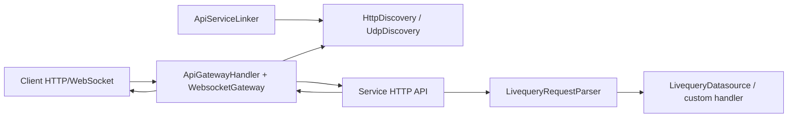

# AGENTS.md

This document is for AI agents and developers working in the `@livequery/core` repository.

## Project Purpose

`@livequery/core` is the framework-agnostic runtime package for Livequery.

It provides:

- Shared request/response/context types.
- A handler interface for parser, middleware, datasource, auth, and realtime layers.
- Request parsing into normalized Livequery refs.
- Ohayo HTTP-based service and gateway discovery.
- HTTP gateway routing and forwarding.
- Service metadata publishing.
- WebSocket realtime subscription routing.
- Response sanitization helpers.

The package does not execute database queries and does not depend on one HTTP framework.

## Livequery Specification

Before implementing request parsing, handlers, datasources, custom actions, response bodies, or realtime emission behavior, read `LIVEQUERY_SPEC.md`.

That file is the canonical framework- and database-independent definition of:

- Livequery refs.
- Collection and document path grammar.
- Default HTTP-method actions.
- Custom actions using `~verb`, which must use `POST`.
- Standard response envelopes: success responses use `{ data: ... }`, errors use `{ error: { message, code } }`.
- Fake or non-database Livequery handlers.
- Realtime create/update/delete emission with `WebsocketGateway.next(...)`.

## Current Public API

The public entrypoint is `src/index.ts`.

It exports:

- `const.ts`
- `Discovery.ts`
- `HttpDiscovery.ts`
- `UdpDiscovery.ts`
- `WebsocketGateway.ts`
- `ApiGatewayHandler.ts`
- `ApiServiceLinker.ts`
- `LivequeryContext.ts`
- `LivequeryDatasource.ts`
- `LivequeryRequestParser.ts`
- `helpers/hidePrivateFields.ts`

## Architecture



## Module Guide

### `src/LivequeryContext.ts`

Core type definitions:

- `CollectionResponse<T>`: collection response with `items`, `paging`, and `cursor`.
- `DocumentResponse<T>`: document response with `item`.
- `RawRequest`: framework-adapter request shape.
- `LivequeryRequest<I>`: normalized request produced by `LivequeryRequestParser`.
- `LivequeryContext<T>`: shared context passed through handler pipelines.
- `LivequeryHandler<O>`: interface with `handle(ctx)`.

When adding a pipeline component, prefer implementing `LivequeryHandler`.

### `src/LivequeryRequestParser.ts`

First handler in a typical request pipeline.

- Input: `ctx.request`.
- Output: `ctx.livequery`.
- Requires the first path segment to be `livequery` and parses the data ref from the next segment.
- Removes query strings before parsing path segments.
- Removes suffixes after `~` in the pathname while preserving `~` inside query values.
- Detects document requests when the route pattern ends with a param segment.
- Uppercases the request method.

Important test cases:

- Collection path.
- Document path.
- Nested collection and document paths.
- Query string and `~` suffix handling.
- Query strings that contain `~`.
- Missing document ids for document-shaped route patterns.
- Paths missing the required Livequery prefix.
- Empty path.

### `src/LivequeryDatasource.ts`

Type abstraction for datasource adapters.

A datasource must:

- Implement `handle(ctx)`.
- Implement `init(routes)`.

This file defines types only. It does not export a runtime class.

### `src/ApiGatewayHandler.ts`

HTTP gateway and reverse proxy.

Public methods:

- `register({ node_id, hostname, port, paths })`
- `deregister(node_id)`
- `fetch(request: Request): Promise<Response>`
- `fetch(req, res, extraHeaders?): Promise<void>`
- `fetchRequest(request)`
- `close()`

Behavior to preserve:

- Discovery only accepts metadata with `role === 'service'`.
- Metadata must match `API_GATEWAY_NAMESPACE`.
- Stale metadata is ignored when its discovery `seq` is older or equal.
- Newer metadata with the same service definition updates metadata and host only.
- Newer metadata with a changed service definition removes old routes and joins again.
- Offline discovery events remove the service from every route.
- Route matching supports static segments, wildcard `:`, and prefix-param segments such as `post:`.
- Route hosts are selected by round-robin.
- Forwarded headers remove `content-length` and `host`.
- When `ws` exists in options, realtime forwarding headers are set from `x-lcid`, `socket_id`, and `x-lgid`.

Error responses:

- `404 API_NOT_FOUND`
- `503 API_OFFLINE`
- `502 SERVICE_API_OFFLINE`

### `src/ApiServiceLinker.ts`

Service-side metadata publisher.

Public methods:

- `start(name, port)`
- `close()`

Behavior:

- Publishes Ohayo discovery messages whose `data.role` is `service`.
- Includes configured `paths`.
- Includes websocket metadata when options include `ws`.
- When it sees a gateway in the same namespace, it bumps metadata `version`/`seq` and broadcasts again.

### `src/Discovery.ts`

Shared discovery abstraction.

- `DiscoveryMessage<T>` is the Ohayo envelope with `node_id`, `namespace`, `tags`, `version`, `created_at`, `seq`, and app-specific `data`.
- `Discovery<T>` extends `Observable<DiscoveryEvent<T>>` and exposes `broadcast(message)` plus `close()`.
- `DiscoveryOfflineData` uses `{ status: 'offline' }` for TTL or deregister events.
- Discovery implementations filter namespace exactly and tags with contains-all semantics.

### `src/HttpDiscovery.ts`

Ohayo HTTP discovery adapter.

Public API:

- Constructor: `new HttpDiscovery<T>({ namespace, tags, node_id?, key?, port?, gateways?, listen?, heartbeatMs?, ttlMs?, requestTimeoutMs? })`
- `status$`
- `port`
- `broadcast(message)`
- `close()`

Behavior:

- Gateway-side discovery listens for `POST /register`, `DELETE /register/:node_id`, `GET /health`, and `GET /nodes`.
- Registry requests use `Authorization: Bearer <OHAYO_DISCOVERY_KEY>`.
- Service-side discovery uses `OHAYO_API_GATEWAY` when `gateways` is not provided.
- Heartbeats rebroadcast the last message with bumped `version`, `created_at`, and `seq`.
- TTL expiry emits an offline discovery event.
- `close()` sends best-effort deregistration for the last broadcast message.
- Transport must keep Livequery metadata inside `data`; it may attach transport metadata such as `remote_host` at the envelope level.

### `src/UdpDiscovery.ts`

Compatibility re-export of the shared `@ohayo/udp` implementation. UDP socket,
packet codec, HMAC, multicast and peer behavior must be changed in `@ohayo/udp`,
not duplicated in core. Runnable integration belongs in
`examples/udp-auto-discovery`, not a Livequery UDP wrapper package.

Public API:

- Constructor: `new UdpDiscovery<T>({ namespace, tags, node_id?, key?, port?, peers?, multicastAddress?, packetTtlMs?, broadcastCopies? })`
- `status$`
- `broadcast(message, targetIp?)`
- `close()`

Behavior:

- Implements the shared `Discovery<T>` contract.
- Packets are msgpack encoded.
- Packet shape is `{ version, sender_id, timestamp, message, signature }`.
- `message` is the Ohayo `DiscoveryMessage<T>` envelope; app metadata must stay inside `message.data`.
- Packets are signed with HMAC SHA-256.
- Packets older than 30 seconds are rejected.
- Packets with invalid signatures are rejected.
- Inbound and outbound messages are filtered by exact `namespace` and contains-all `tags`.
- When `node_id` is configured, outbound messages must use it and inbound messages from the same id are ignored.
- Duplicate valid packets are emitted. Consumers handle dedupe.
- `seq` and `version` ordering is not handled in UDP transport. Consumers handle staleness.
- `close()` is idempotent.

UDP tests should use random ports to avoid conflicts.

### `src/WebsocketGateway.ts`

Realtime gateway. Extends `Subject<UpdatedData>`.

Public API:

- Constructor: `new WebsocketGateway(http.Server | portNumber)`
- `id`
- `auth`
- `handle(ctx)`
- `listen(events)`
- `unsubscribe_client(socket, body)`
- `detach(clientId, refs)`
- `link(ref, handler)`
- `connect(url, auth, ondisconnect?)`
- `close()`

Behavior:

- Node mode uses the `ws` package at `WEBSOCKET_PATH`.
- Bun mode uses `Bun.serve`.
- Client start event: `{ event: 'start', data: { id, auth } }`.
- Gateway-to-gateway auth uses `this.auth`.
- Duplicate socket ids are closed.
- `next(updatedData)` broadcasts `sync` to subscribers of `ref` and `${ref}/${data.id}`.
- `handle(ctx)` reads `ctx.livequery.ref`, `x-lcid` or `socket_id`, and `x-lgid`.
- `detach(clientId, refs)` removes a client from one ref or multiple refs without requiring the socket object.
- `link(ref, handler)` creates an update stream only when the ref already has a subscription.

### Helpers

`src/helpers/hidePrivateFields.ts`

- `hidePrivateFieldsInItem(item)`: removes fields starting with `_`, and maps `_id` to `id` when `id` is missing.
- `hidePrivateFields(data)`: supports plain items, collection responses, and document responses.

`src/helpers/nodeRequestToWebRequest.ts`

- Converts Node.js `IncomingMessage` with optional `rawBody` into a Web `Request`.
- Uses the host header or `127.0.0.1`.
- Merges `extraHeaders`.
- Omits body for `GET` and `HEAD`.

`src/helpers/writeWebResponse.ts`

- Copies a Web `Response` into a Node.js `ServerResponse`.

## Repository Rules

- Source is TypeScript ESM.
- Source imports must use `.js` extensions.
- Do not import through `src/index.ts` from inside `src`; import direct modules to avoid circular dependencies.
- Public runtime APIs must be exported from `src/index.ts`.
- When changing public classes or functions, update tests, `README.md`, and this file.
- Tests use `bun:test`.
- Test type-checking uses `tests/tsconfig.json`.
- Close `UdpDiscovery`, `ApiGatewayHandler`, `ApiServiceLinker`, and `WebsocketGateway` instances in tests to avoid socket leaks.
- UDP tests should use random ports.
- HTTP server tests should close servers and active connections.

## Commands

```sh
bun run build
bun test tests/
bunx tsc -p tests/tsconfig.json --noEmit
```

## Test Layout

- `tests/entrypoint.test.ts`: public exports.
- Request parser tests: `LivequeryRequestParser`.
- `tests/api-gateway.test.ts`: gateway routing, discovery metadata, forwarding, errors, and round-robin.
- `tests/api-service-linker.test.ts`: service metadata publishing and rebroadcast behavior.
- `tests/http-discovery.test.ts`: Ohayo HTTP discovery registration, auth, namespace/tags filtering, and TTL offline events.
- `tests/udp-discovery.test.ts`: UDP packet validation, signatures, TTL, status, and close behavior.
- `tests/websocket-gateway.test.ts`: WebSocket lifecycle, subscriptions, observable links, and gateway bridge behavior.
- `tests/hono-api-gateway.e2e.test.ts`: in-process Hono service/gateway integration.
- `tests/hono-api-gateway-process.e2e.test.ts`: multi-process Hono services, gateway discovery, restart, and round-robin.
- `tests/hidePrivateFields.test.ts`: response sanitization.
- `tests/http-helpers.test.ts`: Node/Web HTTP helper conversion.

## When To Edit Tests Or Source

- If the user asks to edit tests only, do not modify `src`.
- If a new test exposes a source bug and the user did not allow source edits, report the bug clearly.
- If the user asks for implementation work, update source and relevant tests together.

## Final Verification Checklist

1. Run `bun run build`.
2. Run `bun test tests/`.
3. Run `bunx tsc -p tests/tsconfig.json --noEmit` when tests or test types changed.
4. Report changed files and verification results.
