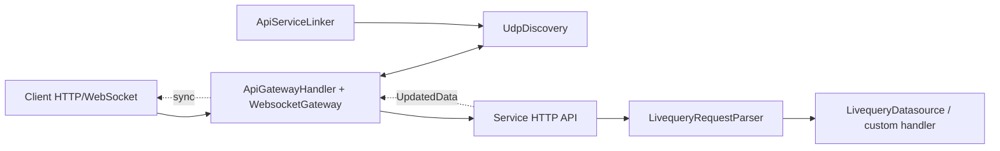

# @livequery/core

`@livequery/core` is the framework-agnostic runtime layer for the Livequery ecosystem. It defines the shared primitives that HTTP adapters, datasource adapters, API gateways, service processes, and realtime WebSocket gateways use to communicate through one normalized request model.

This package does not execute database queries and does not require a specific HTTP framework. Datasources and service handlers decide how each normalized Livequery request is read, written, updated, deleted, or handled as a custom action.

The canonical protocol document is [`LIVEQUERY_SPEC.md`](./LIVEQUERY_SPEC.md). Treat it as the source of truth for path grammar, response envelopes, custom actions, and realtime update behavior.

## Overview

Livequery treats an HTTP path as a structured data reference.

| HTTP path | Normalized ref | Meaning |
| --- | --- | --- |
| `/livequery/posts` | `posts` | The `posts` collection |
| `/livequery/posts/p1` | `posts/p1` | Document `p1` in `posts` |
| `/livequery/users/u1/posts` | `users/u1/posts` | Nested `posts` collection for user `u1` |
| `/livequery/users/u1/posts/p1` | `users/u1/posts/p1` | Nested document `p1` |

Every Livequery API path must start with `/livequery`. That prefix is only a framework route prefix and is not part of the normalized data reference.

## Responsibilities

`@livequery/core` provides:

- Shared request, response, context, and handler types.
- Request parsing from framework routes into `LivequeryRequest`.
- A datasource adapter interface.
- An HTTP gateway that routes requests to online service nodes.
- A service linker that publishes service metadata.
- UDP discovery for gateway and service node discovery.
- A WebSocket gateway for realtime subscriptions and update forwarding.
- Helpers for hiding private response fields.

Typical architecture:



## Installation And Development

```sh
bun add @livequery/core
```

Inside this repository:

```sh
bun install
bun run build
bun test tests/
bunx tsc -p tests/tsconfig.json --noEmit
```

## Entry Points

The default entry point exports the Node WebSocket adapter for backward compatibility:

```ts
import {
  ApiGatewayHandler,
  ApiServiceLinker,
  LivequeryRequestParser,
  UdpDiscovery,
  WebsocketGateway,
  hidePrivateFields,
} from '@livequery/core'
```

Runtime-specific entry points:

```ts
import { WebsocketGateway } from '@livequery/core/node'
import { BunWebsocketGateway } from '@livequery/core/bun'
import { EdgeWebsocketGateway } from '@livequery/core/workers'
```

`@livequery/core/workers` does not export `UdpDiscovery` because edge runtimes generally do not provide UDP sockets.

## Basic Request Pipeline

A framework adapter usually creates a `RawRequest`, passes it through `LivequeryRequestParser`, then passes `ctx.livequery` to a datasource or downstream middleware.

```ts
import {
  LivequeryRequestParser,
  type LivequeryContext,
} from '@livequery/core'

const ctx: LivequeryContext = {
  request: {
    path: '/livequery/posts/p1',
    ref: '/livequery/posts/:id',
    method: 'get',
    body: undefined,
    params: { id: 'p1' },
    query: {},
    headers: new Map(),
  },
}

new LivequeryRequestParser().handle(ctx)

console.log(ctx.livequery)
// {
//   ref: 'posts/p1',
//   collection_ref: 'posts',
//   schema_collection_ref: 'posts',
//   document_id: 'p1',
//   keys: { id: 'p1' },
//   method: 'GET',
//   ...
// }
```

## Core Types

### `RawRequest`

Input request created by a framework adapter:

```ts
type RawRequest = {
  path: string
  ref: string
  method: string
  body?: any
  params: Record<string, any>
  query: Record<string, any>
  headers: Map<string, string>
}
```

- `path`: the actual request path, for example `/livequery/posts/p1`.
- `ref`: the matched route pattern, for example `/livequery/posts/:id`.
- `params`: route params parsed by the framework.
- `query`: parsed query params.
- `headers`: header map used by handlers such as `WebsocketGateway`.

### `LivequeryRequest<I>`

Output created by `LivequeryRequestParser`:

```ts
type LivequeryRequest<I> = {
  keys: Record<string, any>
  path: string
  document_id?: string
  collection: string
  collection_ref: string
  schema: string
  schema_collection_ref: string
  ref: string
  method: string
  body: I
  query: Record<string, any>
  action?: string
}
```

- `ref`: concrete data reference, for example `posts/p1`.
- `collection`: last segment of `collection_ref`, for example `posts`.
- `collection_ref`: collection that contains the item, for example `posts`.
- `schema`: collection ref using route parameter names and preserving `:`, for example `users/:uid/posts`.
- `schema_collection_ref`: collection ref using route parameter names, for example `users/uid/posts`.
- `document_id`: document id when the route pattern ends with a parameter.
- `action`: custom action parsed from a `~` suffix, for example `/posts/p1~publish` creates `action: 'publish'`.
- `method`: uppercased HTTP method.

### `LivequeryContext<T>`

Context object passed through the handler pipeline:

```ts
type LivequeryContext<T = {}> = {
  request: RawRequest
  livequery?: LivequeryRequest<any>
  response?: T
}
```

### `LivequeryHandler<O>`

Common contract for parsers, middleware, datasources, auth handlers, and realtime handlers:

```ts
type LivequeryHandler<O = {}> = {
  handle(ctx: LivequeryContext<O>): any
}
```

### Response Shapes

Collection response:

```ts
type CollectionResponse<T> = {
  items: T[]
  paging: {
    current: number
    total: number
  }
  cursor: {
    current: string
    next: string
    prev: string
  }
}
```

Document response:

```ts
type DocumentResponse<T> = {
  item: T
}
```

Response envelope from the protocol spec:

```ts
type LivequerySuccessResponse<T> = { data: T }
type LivequeryErrorResponse = {
  error: {
    message: string
    code: string
  }
}
```

## `LivequeryRequestParser`

`LivequeryRequestParser` reads `ctx.request` and writes `ctx.livequery`.
Use `LivequeryRequestParser.parse(request)` to reuse the same parser without creating a handler context.

The parser:

- Requires the first path segment to be `livequery` and parses the data ref from the next segment.
- Removes query strings before parsing path segments.
- Removes the `~` suffix from the pathname and exposes it as `action`.
- Preserves `~` inside query string values.
- Detects document routes when the route pattern ends with a parameter, for example `:id`.
- Uppercases the HTTP method.

Custom action example:

```ts
const ctx: LivequeryContext = {
  request: {
    path: '/livequery/posts/p1~publish?reason=review',
    ref: '/livequery/posts/:id~publish',
    method: 'post',
    params: { id: 'p1' },
    query: { reason: 'review' },
    headers: new Map(),
  },
}

new LivequeryRequestParser().handle(ctx)

const livequery = LivequeryRequestParser.parse(ctx.request)

// ctx.livequery.action === 'publish'
// ctx.livequery.ref === 'posts/p1'
// ctx.livequery.document_id === 'p1'
// ctx.livequery.method === 'POST'
```

## `LivequeryDatasource`

`LivequeryDatasource<RouteConfig>` is the abstraction for datasource adapters.

```ts
type LivequeryDatasourceInitConfig<Config> = Config & {
  method: string
  path: string
}

type LivequeryDatasource<RouteConfig> = LivequeryHandler & {
  init(routes: Array<LivequeryDatasourceInitConfig<RouteConfig>>): Promise<void> | void
}
```

A datasource should:

- Use `init(routes)` to register route configuration.
- Use `handle(ctx)` to read `ctx.livequery` and set `ctx.response`.

```ts
import type { LivequeryContext, LivequeryDatasource } from '@livequery/core'

type RouteConfig = { table: string }

class MemoryDatasource implements LivequeryDatasource<RouteConfig> {
  #routes = new Map<string, RouteConfig>()

  init(routes: Array<RouteConfig & { method: string; path: string }>) {
    for (const route of routes) {
      this.#routes.set(`${route.method.toUpperCase()} ${route.path}`, route)
    }
  }

  handle(ctx: LivequeryContext) {
    if (!ctx.livequery) return

    ctx.response = {
      item: {
        id: ctx.livequery.document_id,
        ref: ctx.livequery.ref,
      },
    }
  }
}
```

## `ApiGatewayHandler`

`ApiGatewayHandler` is an HTTP gateway and reverse proxy for Livequery service nodes.

Main behavior:

- Receives service metadata from `UdpDiscovery`.
- Registers routes by method and path.
- Forwards Web `Request` or Node `IncomingMessage` requests to online services.
- Round-robins across multiple hosts for the same route.
- Connects gateway-to-gateway WebSockets when service metadata includes `ws`.
- Marks hosts offline when upstream fetch fails or WebSocket connectivity is lost.

Constructor:

```ts
const gateway = new ApiGatewayHandler({
  node_id: 'gateway-1',
  discovery,
  ws: websocketGateway,
})
```

Manual route registration:

```ts
gateway.register({
  node_id: 'service-1',
  hostname: '127.0.0.1',
  port: 3001,
  paths: [{ method: 'GET', path: 'livequery/posts' }],
})
```

Forward a Web Request:

```ts
const response = await gateway.fetch(
  new Request('http://gateway/livequery/posts')
)
```

Use with a Node HTTP server:

```ts
import * as http from 'http'
import { ApiGatewayHandler } from '@livequery/core'

const gateway = new ApiGatewayHandler({})

http.createServer((req, res) => {
  gateway.fetch(req as any, res)
}).listen(3000)
```

Error responses:

| Status | Code | Condition |
| --- | --- | --- |
| `404` | `API_NOT_FOUND` | No route matches the method/path |
| `503` | `API_OFFLINE` | The route exists but all hosts are offline |
| `502` | `SERVICE_API_OFFLINE` | Fetching the upstream service failed |

Call `gateway.close()` during shutdown to unsubscribe from discovery, close sockets, and clear internal service state.

## `ApiServiceLinker`

`ApiServiceLinker` runs inside a service process and publishes service metadata so gateways can discover it.

```ts
const linker = new ApiServiceLinker({
  paths: [
    { method: 'GET', path: 'livequery/posts' },
    { method: 'POST', path: 'livequery/posts' },
  ],
  ws: websocketGateway,
})

linker.start('posts-service', 3001)
```

Published metadata includes:

- `role: 'service'`
- `namespace`
- `node_id`
- `name`
- `port`
- `paths`
- WebSocket metadata when `ws` is configured

When the service sees a gateway in the same namespace, the linker bumps its metadata `version` and broadcasts again so newly online gateways can join the service.

Call `linker.close()` during shutdown.

## `UdpDiscovery`

`UdpDiscovery<T>` is an observable discovery layer over UDP multicast and local relay.

```ts
import { UdpDiscovery, type UdpDiscoveryNode } from '@livequery/core'

type Node = UdpDiscoveryNode & { role: 'service' | 'gateway' }

const discovery = new UdpDiscovery<Node>({
  key: 'shared-secret',
  port: 11001,
})

discovery.subscribe(node => {
  console.log('node online', node)
})

await discovery.broadcast({
  node_id: 'service-1',
  namespace: 'default',
  version: Date.now(),
  role: 'service',
})
```

Behavior:

- Packets are encoded with msgpack.
- Packets are signed with HMAC SHA-256 using `key`.
- Packets older than 30 seconds are ignored.
- Packets with invalid signatures are ignored.
- Duplicate packets may be emitted; consumers deduplicate if needed.
- Namespace filtering is handled by consumers such as `ApiGatewayHandler`, not by `UdpDiscovery`.

`status$` emits:

- `not_ready`
- `ready`
- `closed`

## `WebsocketGatewayBase` And `WebsocketGateway`

`WebsocketGatewayBase` contains the runtime-agnostic realtime protocol. Node, Bun, and Edge adapters only provide transport.

`WebsocketGatewayBase` extends `Subject<UpdatedData>`, so a service can publish updates with:

```ts
wsGateway.next({
  ref: 'posts',
  type: 'update',
  data: { id: 'p1', title: 'Updated' },
})
```

The gateway sends a `sync` event to clients subscribed to `posts` or `posts/p1`.

Important public API:

- `id`: gateway id.
- `auth`: token used for gateway-to-gateway connections.
- `handle(ctx)`: registers a subscription from `ctx.livequery.ref` and request headers `x-lcid`/`socket_id`, `x-lgid`.
- `listen(events)`: registers subscriptions directly.
- `unsubscribe_client(socket, body)`: handles unsubscribe socket messages.
- `detach(clientId, refs)`: removes a client from one or more refs.
- `link(ref, handler)`: creates an update stream only when the ref already has a subscription.
- `connect(url, auth, onoffline?, ondone?, onreconnect?)`: connects to another gateway using `globalThis.WebSocket`.
- `close()`: closes sockets, subscriptions, and linked streams.

### Node

The default `WebsocketGateway` uses the `ws` package:

```ts
import * as http from 'http'
import { WebsocketGateway } from '@livequery/core'

const server = http.createServer()
const ws = new WebsocketGateway(server)

server.listen(3000)
```

Attach later:

```ts
const ws = new WebsocketGateway()
ws.attach(server)
```

### Bun

```ts
import { BunWebsocketGateway } from '@livequery/core/bun'

const ws = new BunWebsocketGateway()
ws.serve(15535)
```

Or use it inside an existing `Bun.serve`:

```ts
Bun.serve({
  fetch(req, server) {
    if (new URL(req.url).pathname === '/livequery/realtime-updates') {
      if (ws.attachBunUpgrade(req, server)) return
    }
    return new Response('Not found', { status: 404 })
  },
  websocket: ws.getBunWebsocketHandlers(),
})
```

### Edge Workers

```ts
import { EdgeWebsocketGateway } from '@livequery/core/workers'

const gateway = new EdgeWebsocketGateway()

export default {
  fetch(request: Request) {
    if (new URL(request.url).pathname === '/livequery/realtime-updates') {
      return gateway.handleRequest(request)
    }
    return new Response('Not found', { status: 404 })
  },
}
```

In production edge runtimes, put gateway state in a Durable Object or equivalent stateful runtime if subscriptions must survive across requests.

## Helpers

### `hidePrivateFields`

Hides fields that start with `_` before returning a response. `_id` is mapped to `id` when `id` does not already exist.

```ts
hidePrivateFields({
  item: { _id: 'p1', _secret: 'hidden', title: 'Hello' },
})

// { item: { id: 'p1', title: 'Hello' } }
```

It supports `CollectionResponse`, `DocumentResponse`, and plain objects.

### `nodeRequestToWebRequest`

Converts a Node `IncomingMessage` into a Web `Request`. `ApiGatewayHandler.fetch(req, res)` uses this helper internally.

### `writeWebResponse`

Writes a Web `Response` into a Node `ServerResponse`. `ApiGatewayHandler.fetch(req, res)` uses this helper internally.

## Environment Variables

| Variable | Default | Meaning |
| --- | --- | --- |
| `API_GATEWAY_NAMESPACE` | `default` | Namespace for gateway/service metadata |
| `LIVEQUERY_MAGIC_KEY` | `livequery/` | Secret key used to sign UDP discovery packets |
| `UDP_PUBLIC_PORT` | `11001` | UDP discovery port |
| `UDP_MULTICAST_ADDRESS` | `239.0.1.1` | Multicast address for discovery |
| `UDP_WHITELIST_ADDRESS` | empty | Additional peer IPs or prefixes, comma-separated |
| `REALTIME_UPDATE_SOCKET_PATH` | `/livequery/realtime-updates` | Realtime WebSocket path |
| `LIVEQUERY_API_GATEWAY_DEBUG` | false | Enables gateway/service lifecycle logs |
| `LIVEQUERY_UDP_DEBUG` | false | Enables UDP discovery error logs |

## Minimal Gateway-Service Flow

Service process:

```ts
import { ApiServiceLinker, LivequeryRequestParser } from '@livequery/core'

const parser = new LivequeryRequestParser()

// A framework adapter creates ctx from an HTTP request, then:
// parser.handle(ctx)
// datasource.handle(ctx)

const linker = new ApiServiceLinker({
  paths: [{ method: 'GET', path: 'livequery/posts' }],
})

linker.start('posts-service', 3001)
```

Gateway process:

```ts
import * as http from 'http'
import { ApiGatewayHandler, WebsocketGateway } from '@livequery/core'

const server = http.createServer()
const ws = new WebsocketGateway(server)
const gateway = new ApiGatewayHandler({ ws })

server.on('request', (req, res) => {
  gateway.fetch(req as any, res)
})

server.listen(3000)
```

Client requests enter the gateway, the gateway resolves a matching route, selects an online service host, forwards the request, and returns the service response to the client.

## Extension Notes

- If parser behavior or action grammar changes, update `LIVEQUERY_SPEC.md` and parser tests.
- When adding a datasource adapter, prefer implementing `LivequeryDatasource`.
- Successful responses should be wrapped in `{ data: ... }`; errors should use `{ error: { message, code } }`.
- Gateway route paths should match the path exposed by the framework, for example `livequery/posts` or `livequery/posts/:id`.
- Realtime subscriptions depend on `x-lcid` or `socket_id`; when the gateway has `ws`, `ApiGatewayHandler` forwards `x-lgid`.
- Call `close()` on gateways, linkers, discovery instances, and WebSocket gateways during shutdown.
